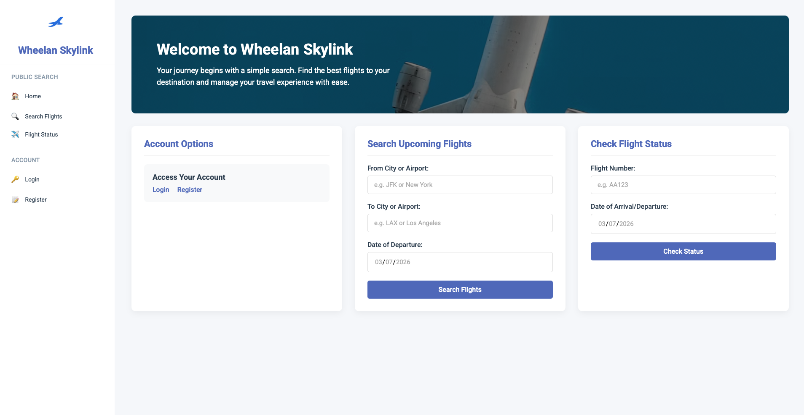

# AirTicket-Reservation-System
A full-stack airline reservation system built with MySQL and Flask, using 15+ normalized tables and 30+ SQL queries to support flight search, booking, and analytics for customers, agents, and airline staff.
<p align="center">

</p>

# Tech Stack
- Backend: Python (Flask)
- Database: MySQL
- Frontend: HTML, CSS
  - HTML Explanation: [Templates](templates/templates_explanation.pdf)
- Query Language: SQL
  - Query Explanation: [Query](database/sql_query_explanation.pdf)

# Key Features
Public Users
- Search flights by departure, destination, and date
- Check flight status
- Register and log in

Customers
- Search and purchase flights
- View upcoming and past flights
- Track spending statistics


Booking Agents
- Book flights on behalf of customers
- View commission statistics
- Identify top customers

Airline Staff
- Create and manage flights
- Update flight status
- Add airplanes and airports
- Generate sales and revenue reports

# How to run
### 1. Start MySQL server

```bash
brew services start mysql
```

### 2. Create the Database

```bash
mysql -u root -h 127.0.0.1 -P 3306
```

```sql
CREATE DATABASE air_reservation;
EXIT;
```

### 3. Import the Schema

```bash
mysql -u root -h 127.0.0.1 -P 3306 air_reservation < air_reservation.sql
```

### 4. Run the Application

```bash
python main.py
```

### 5. Open the Application

Go to:

```
http://localhost:5000
```
